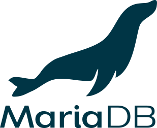

  

  
  

# 🚀About Me

- 📓Computer Engineering Undergraduate
- 🎓A passionate programmer with a lot of side projects
- 💬Bilingual, speaking Thai and English

# 💻Programming Languages

# 📚Tech Stack

| Docker                         | SQLite                         | MySQL                        | MariaDB                          |
| ------------------------------ | ------------------------------ | ---------------------------- | -------------------------------- |
|  |  |  |  |

| Svelte/SvelteKit               | React                        | Kivy                       | Godot                        |
| ------------------------------ | ---------------------------- | -------------------------- | ---------------------------- |
|  |  |  |  |

| Tailwind                           | SCSS                       |
| ---------------------------------- | -------------------------- |
|  |  |

# 🔰Experiences

- Neovim
- Linux (Arch Linux, Debian, Linux Mint)
